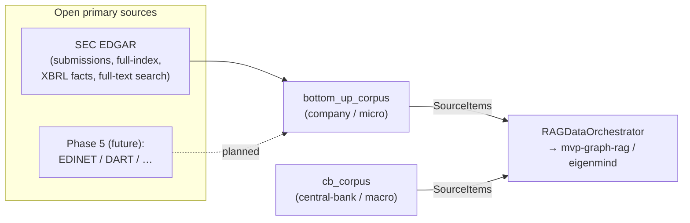
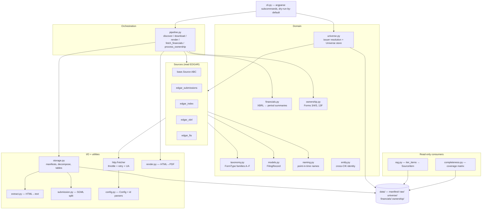
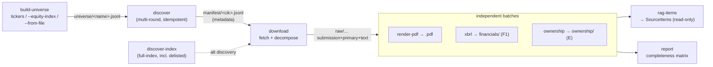
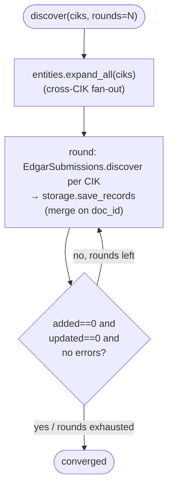
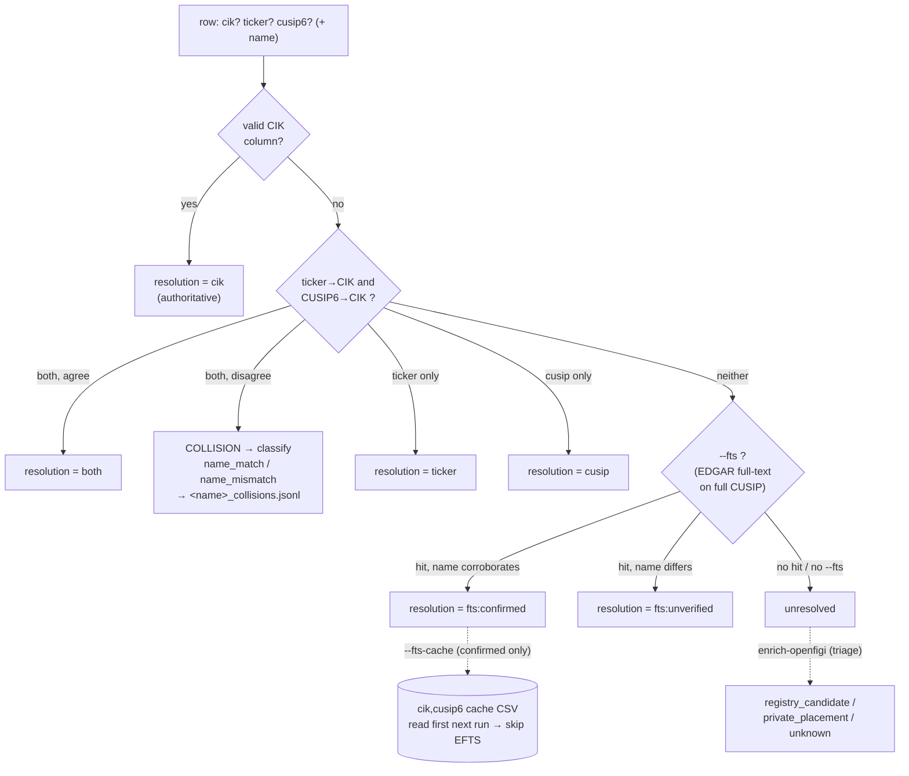
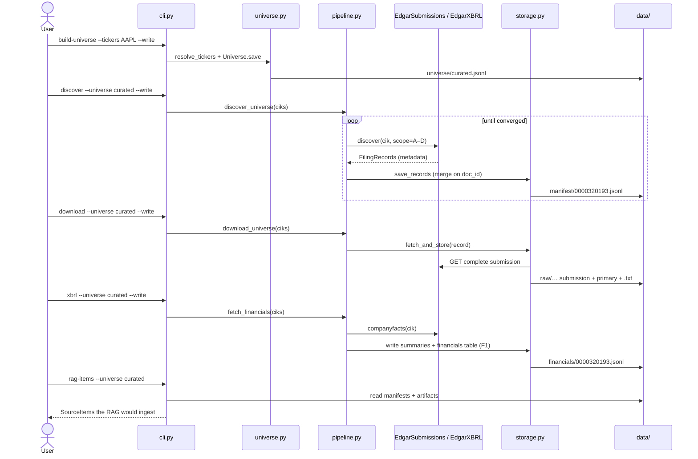

# Architecture — `bottom_up_corpus`

How the repo is put together and how data flows through it. The
[README](../README.md) is the quickstart (install, taxonomy, storage layout,
command usage); this document is the **map**: what each layer does, how a corpus
is built end to end, and the design invariants that hold everything together.

> Diagrams below are [Mermaid](https://mermaid.js.org/) — GitHub renders them
> inline.

---

## 1. What it is

`bottom_up_corpus` builds an **exhaustive, replicable, open-data corpus of company
primary-source filings** — the *bottom-up / micro* layer that complements
`cb_corpus` (the central-bank *macro* layer). Both feed the same downstream RAG
stack via a shared `RAGDataOrchestrator` contract.

The anchor source is **SEC EDGAR** (all filings are public-domain). Everything is
keyed on the SEC **CIK** (Central Index Key), the permanent issuer anchor.



### Core principles

| Principle | What it means here |
|---|---|
| **Official primary sources only** | Every document comes from the issuer's regulator of record (`*.sec.gov`); provenance is recorded per filing. |
| **Replicability** | Stable, date-independent `doc_id`s; idempotent multi-round crawls; deterministic on-disk layout; atomic writes. |
| **Exhaustivity** | Discovery via EDGAR's own indices/APIs; a completeness matrix reconciles discovered vs. expected; errors are logged, never silently dropped. |
| **Open data** | No proprietary datasets, machine translations, or model-generated text in the corpus. |
| **Fair access** | One throttled, contact-carrying HTTP client (≤10 req/s, the SEC ceiling). |

---

## 2. Layered module map

The package is a thin **CLI** over a **pipeline** orchestration layer, which drives
**sources** (read EDGAR), **storage** (persist/decompose), and a **domain** layer
(taxonomy, identifier resolution, extraction). Data lands as JSONL + raw files
under `data/`.



Module responsibilities, one line each:

| Module | Responsibility |
|---|---|
| `cli.py` | All subcommands; global `--data-dir/--contact/--insecure`; dry-run-by-default + `--write`. |
| `pipeline.py` | Orchestrates discover → download → render / financials / ownership; idempotent convergence; `*Report` dataclasses. |
| `sources/base.py` | `Source` ABC — turns an EDGAR endpoint into a stream of `FilingRecord`; never raises on one bad item. |
| `sources/edgar_submissions.py` | Per-issuer filing history (`data.sec.gov/submissions`). The curated-tier workhorse. |
| `sources/edgar_index.py` | Quarterly full-index (`full-index/.../master.idx`) — every filer, incl. delisted. |
| `sources/edgar_xbrl.py` | XBRL company-facts → `PeriodSummary` (family F1). |
| `sources/edgar_fts.py` | Reverse CUSIP→CIK via EDGAR full-text search, restricted to offering forms. |
| `models.py` | `FilingRecord` — the manifest unit; stable `doc_id`. |
| `storage.py` | Manifests, complete-submission download + decomposition, financials/ownership tables, error trail; atomic writes. |
| `submission.py` / `extract.py` / `render.py` | SGML split → primary doc; HTML→clean text; HTML→PDF. |
| `taxonomy.py` | `FormType` families A–F; raw-form ↔ code mapping; scope parsing. |
| `universe.py` | Resolve tickers / CIKs / CUSIPs / index → `Issuer`s; the `Universe` JSONL store. |
| `naming.py` / `entity.py` | Point-in-time issuer names; cross-CIK economic-entity joins. |
| `financials.py` / `ownership.py` | Shared financials engine (reported/derived/TTM rows, ~60 curated concepts) — reused by SEC XBRL (`edgar_xbrl`), EU ESEF (`eu/financials.py`), and the register pillar (`registers/`). Structure insider/13F filings. |
| `indices.py` | S&P 500 composition + dated membership (Wikipedia). |
| `rag.py` / `completeness.py` | Read manifests back into `SourceItem`s; audit coverage vs. expected cadence. |
| `config.py` / `http.py` | Runtime config + identifier parsers (`normalize_cik`, `cusip6`, …); the polite Fetcher. |
| `openfigi.py` | **Isolated, optional** identifier enrichment/triage (no SEC, no CIK). Imported only by the CLI. |

---

## 3. The data model

### `FilingRecord` — the manifest unit

One JSON line per filing in `data/manifest/<cik>.jsonl`. Its identity is
**date-independent**: `doc_id = sha1("<cik>|<form-code>|<accession>")[:16]`, so
re-discovering a filing after a date correction never duplicates it.

Key fields: `cik`, `form_type` (a `FormType`), `sec_form`, `accession`, `company`
(point-in-time) + `company_current`, `entity_id`, `filing_date`,
`period_of_report`, `primary_doc_url`, `submission_url`, `provenance`
(`edgar_index | edgar_fts | edgar_submissions | wayback`), and on-disk pointers
`local_path` / `primary_path` / `text_path` / `pdf_path`. `to_row()`/`from_row()`
round-trip it to JSONL.

### Filing taxonomy (families A–F)

`FormType` groups raw EDGAR forms into disclosure families. The default crawl
scope (`FULL_SCOPE`) is the narrative families **A–D**; ownership (E) and
structured financials (F) are opt-in.

| Family | Codes | Forms |
|---|---|---|
| A. Periodic | A1–A4 | 10-K, 10-Q, 20-F, 40-F |
| B. Current / material | B1–B2 | 8-K, 6-K |
| C. Governance | C1–C2 | DEF 14A, other proxy |
| D. Registration / offering | D1–D3 | S-1, S-4, 424B |
| E. Ownership (opt-in) | E1–E3 | Forms 3/4/5, 13F, SC 13D/G |
| F. Structured financials (opt-in) | F1 | XBRL company facts |

### On-disk layout & a filing's artifacts

```mermaid
flowchart TB
    REC["FilingRecord (manifest line)<br/>doc_id = sha1(cik|code|accession)[:16]"]
    subgraph files["data/raw/&lt;cik&gt;/&lt;code&gt;/&lt;year&gt;/&lt;doc_id&gt;.*"]
        SUBMIT[".submission.txt<br/>complete SGML submission (canonical)"]
        PRIM[".primary.&#123;htm,xml&#125;<br/>decomposed primary document"]
        TXT[".txt<br/>cleaned extracted text (RAG reads this)"]
        PDF[".pdf<br/>rendered (after render-pdf)"]
    end
    REC --> SUBMIT --> PRIM --> TXT --> PDF
```



```
data/
├── manifest/<cik>.jsonl       # INDEX: one line per filing (committed) — the map
├── universe/<name>.jsonl      # curated issuer lists (committed); +<name>_changes/_collisions.jsonl
├── financials/<cik>.jsonl     # SEC XBRL structured financials (committed)
├── financials_eu/<lei>.jsonl  # EU ESEF/IFRS structured financials (committed)
├── financials_register/<entity_id>.jsonl  # register statutory financials (committed)
├── ownership/<cik>.jsonl      # normalized insider / 13F rows (committed)
├── discovery_errors.jsonl     # append-only audit trail
├── reports/                   # completeness matrices (incl. register_coverage.jsonl)
└── raw/<cik>/<code>/<year>/   # the documents themselves (git-ignored, regenerable)
```

The manifest is the entry point — every line carries the exact file paths, so you
never decode a hash or browse `raw/` by hand.

---

## 4. The corpus lifecycle

A corpus is built in stages. Each stage is a CLI command; each reads what the
previous wrote. Stages 4a/4b/4c are independent branches off the downloaded corpus.



- **`discover --download`** collapses *discover* + *download* into one call.
- **`discover-index`** is the exhaustive alternative to `discover` (any filer, via
  the quarterly full-index, including delisted/merged issuers).
- `report` and `rag-items` are read-only consumers at the tail; `entities`,
  `list-forms`, `list-universe`, `config` are inspection-only.

### Discovery convergence

`discover_universe` is idempotent and converges: it loops up to `--rounds` times
and **stops early** the moment a round adds 0, updates 0, and logs no errors. Input
CIKs are first **alias-expanded** through the `EntityRegistry`, so one issuer pulls
every CIK of its economic entity (e.g. Alphabet also crawls Google's old CIK).



A run with `dry_run=True` (no `--write`) computes the same stats but persists
nothing — so you can preview exactly what *would* change.

---

## 5. Sources — reading EDGAR

All sources subclass `Source` (shared `Fetcher`, `self.errors`, `_record_error`)
and **never raise on a single bad item** — a failed fetch is recorded and the run
stays *detectably* partial rather than silently truncated.

| Source | Endpoint | Yields | Used by |
|---|---|---|---|
| `EdgarSubmissions` | `data.sec.gov/submissions/CIK….json` | `FilingRecord` (with primary + submission URLs) | `discover`, `download` (default tier) |
| `EdgarFullIndex` | `…/full-index/{yr}/QTR{q}/master.idx` | `FilingRecord` (submission URL only) | `discover-index` (exhaustive) |
| `EdgarXBRL` | `data.sec.gov/api/xbrl/companyfacts/CIK….json` | `PeriodSummary` | `xbrl` |
| `EdgarFTS` | `efts.sec.gov/LATEST/search-index` (offering forms only) | `(cik, display_name)` | `build-universe --fts` |

The throttled `http.Fetcher` (declared contact-carrying User-Agent, per-host ≤10
req/s, retry with backoff on 429/5xx) is the single network chokepoint.

---

## 6. Issuer-resolution waterfall (the universe layer)

`build-universe` turns identifiers into a list of `Issuer`s (CIK-anchored). It
accepts inline tickers/CIKs, the S&P 500 composition, or a **file** of mixed
identifiers (a credit-index export: CIK / Ticker / CUSIP / ISIN columns).

For a file, `reconcile_identifiers` resolves each issuer by **authority
CIK > CUSIP6 > ticker**, with cross-checking and an opt-in network tail:



Key points:
- **CUSIP6 is the robust key** for a bond universe — unlike a ticker it is never
  recycled. The detector catches *recycled-ticker homonyms* (e.g. `DT` →
  Dynatrace, not Deutsche Telekom) when ticker and CUSIP6 disagree.
- **`--fts`** (opt-in, network) recovers issuers no offline tier resolves, by
  reverse-looking-up the CUSIP in EDGAR full-text **restricted to offering forms**
  (an unrestricted search returns fund *holders*, not the issuer). Hits are
  name-corroborated: `fts:confirmed` vs `fts:unverified` (kept, for triage).
- **`--fts-cache FILE`** memoizes `fts:confirmed` resolutions to a reusable
  `cik,cusip6` crosswalk, so repeated runs resolve offline instead of re-querying.
- **`enrich-openfigi`** is a separate, jurisdiction-neutral triage tool (not a
  resolver — it returns no CIK): it labels the unresolved tail
  `registry_candidate` vs `private_placement` so you stop chasing the
  structurally-unreachable (144A/Reg-S, non-profit/muni issuers).

`Issuer`s persist to `data/universe/<name>.jsonl` (deduped by CIK). The S&P 500
mode (`--equity-index sp500`) reconstructs **historical** membership from Wikipedia
(current + dated changes) with `first_seen`/`last_seen` and a sibling
`<name>_changes.jsonl`.

---

## 7. A typical end-to-end run (sequence)

Building a small financials corpus for one issuer:



---

## 8. Design invariants

- **Dry-run by default.** Every side-effecting command persists only under
  `--write` and prints a `DRY-RUN` vs `WROTE` banner. (One transparent
  exception: `--fts-cache` writes its optimization cache when given, since its
  value is realized during dry-run iteration.)
- **Idempotency.** Manifests merge on `doc_id`; re-running converges to
  all-`unchanged`. Downloads/renders skip already-present artifacts (unless
  `--overwrite`).
- **Atomic writes.** Manifests/tables are written to a temp sibling then
  `os.replace`d — no half-written files.
- **Fair access.** A single `Fetcher` carries a contact User-Agent and throttles
  ≤10 req/s; there is **no default contact** (set `$BOTTOM_UP_CORPUS_CONTACT`).
- **Provenance & auditability.** Every record carries a `provenance`; every
  fetch failure is appended to `discovery_errors.jsonl`; `report` reconciles
  discovered vs. expected per issuer/form/year.
- **Point-in-time correctness.** A filing is attributed to the issuer name in
  effect *when it was filed* (`naming.name_as_of`), and joined across renames via
  the `EntityRegistry`.

---

## 9. Extending to new jurisdictions (Phase 5)

This is realized for Europe: the **EU pillar** (`bottom_up_corpus/eu/`) federates
13 national OAMs + Euronext + filings.xbrl.org behind a pluggable `OamSource`
interface, keyed on the GLEIF **LEI/ISIN** instead of the CIK — a parallel pillar
with its own `Document`/`acquire` model (it does **not** reuse the SEC
`Source`/`FilingRecord` pipeline, because EU identity and storage differ). See
[`EU_PILLAR.md`](EU_PILLAR.md) and [`EU_BACKENDS.md`](EU_BACKENDS.md). `openfigi.py`'s
triage (`registry_candidate` / `private_placement`) is jurisdiction-neutral and is
reused there (the ISIN→LEI bridge).

For US-shaped sources, the SEC pillar itself stays source-pluggable: a new
`Source` subclass maps its endpoint to the same `FilingRecord` schema; the storage,
manifest, RAG and completeness layers need no change. Candidate future sources:
Japan EDINET, Korea DART, Brazil CVM.

---

## 10. Structured-financials layer

The same curated row schema (defined in [`FINANCIALS.md`](FINANCIALS.md)) is produced
by three independent paths that share the `financials.py` engine:

| Path | Universe | Source | Module | Output |
|---|---|---|---|---|
| **SEC XBRL** | US listed issuers | EDGAR `companyfacts` | `sources/edgar_xbrl.py` | `data/financials/<cik>.jsonl` |
| **EU ESEF / IFRS** (Pillar B) | EU listed issuers | `filings.xbrl.org` json_url (Tier A) + local ESEF `.zip` via Arelle (Tier B) | `eu/financials.py` | `data/financials_eu/<lei>.jsonl` |
| **Register financials** | Private / credit universe | 8 national registers (🇳🇴 NO · 🇬🇧 UK · 🇧🇪 BE · 🇱🇺 LU · 🇫🇮 FI · 🇩🇰 DK · 🇪🇪 EE · 🇸🇰 SK) | `registers/` | `data/financials_register/<entity_id>.jsonl` |

All three emit the same `kind="reported"` / `kind="derived"` row model. The primary
axis of variation is the **concept-mapping pack** (US-GAAP, IFRS, or
register-specific), but the register path also adds structural features not present
in the SEC/EU paths: a `basis` column (`"company"` / `"consolidated"`) and a
`leverage_basis` field on every leverage-derived row (see below).
The three output directories are **never merged** — they serve different universes
and GAAP regimes (US-GAAP, IFRS, N-GAAP / FRS 102 / local GAAP).

**Register pillar specifics.** `registers/` targets non-listed issuers (bond
obligors, private companies, bank counterparties) that never file ESEF. Each row
carries a `basis` label (`"company"` = legal-entity standalone; `"consolidated"` =
economic group). A **no-false-data** confidence gate suppresses any derived value it
cannot confirm from structural anchors; the reason is recorded per key in
`data/reports/register_coverage.jsonl`.

Registers differ in what they expose for leverage: some provide real financial
**borrowings** (BE/LU/SK/DK-ESEF), others only **total liabilities** as a gearing
proxy (NO/UK/EE/DK-FSA), and Finland suppresses leverage rows entirely because the
maturity split is absent. To prevent blind cross-register comparisons, the four
leverage-derived rows (`total_debt`, `debt_to_equity`, `debt_to_assets`, `net_debt`)
carry a `leverage_basis` field with value `"borrowings"`, `"total_liabilities"`, or
no field (FI). See [`REGISTER_FINANCIALS.md`](REGISTER_FINANCIALS.md) for the full
per-register accounting.
